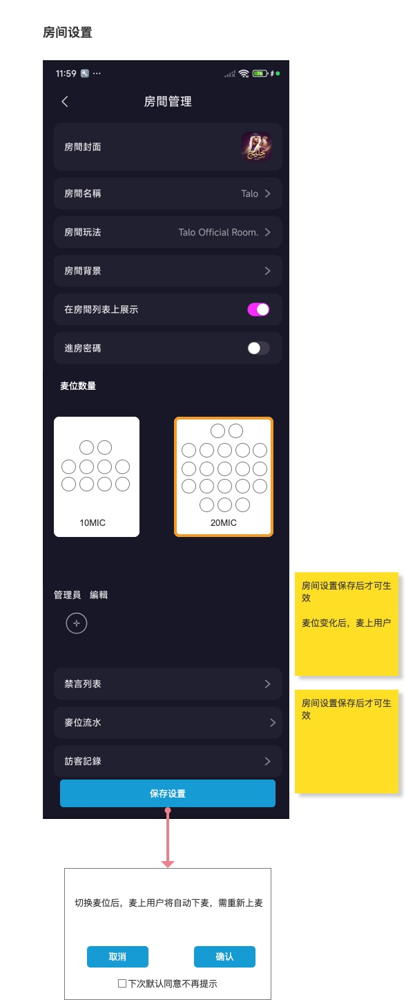
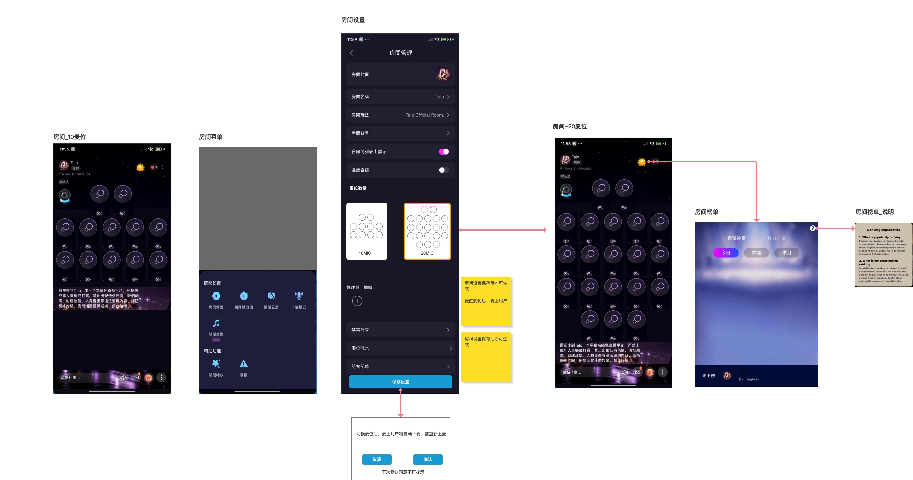
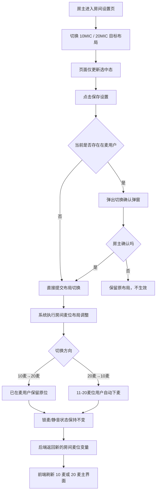
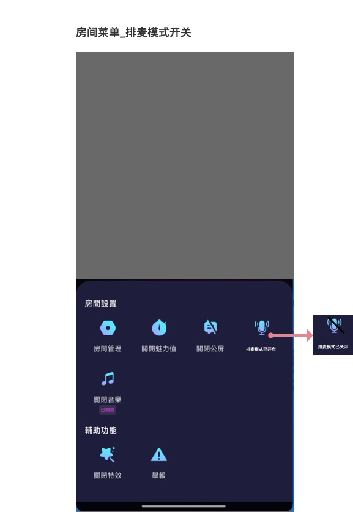
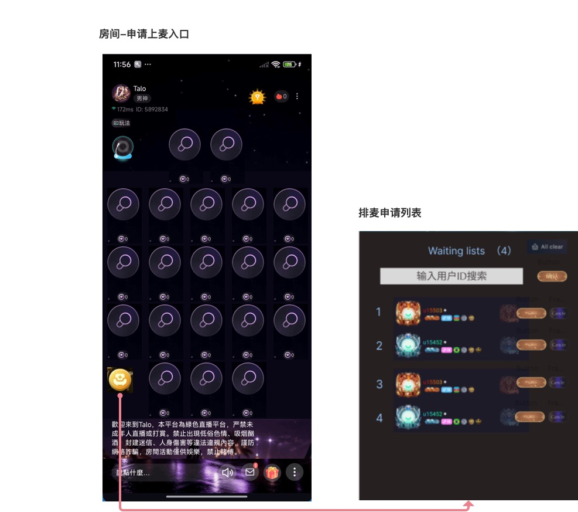
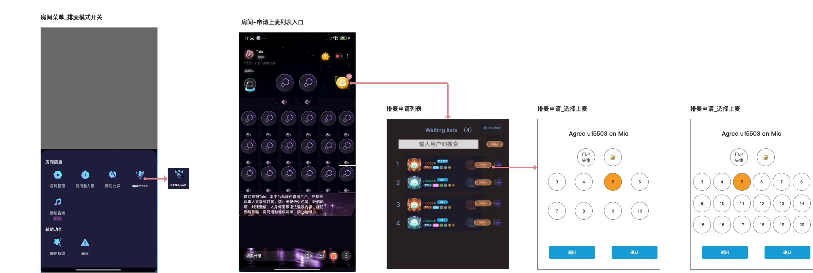
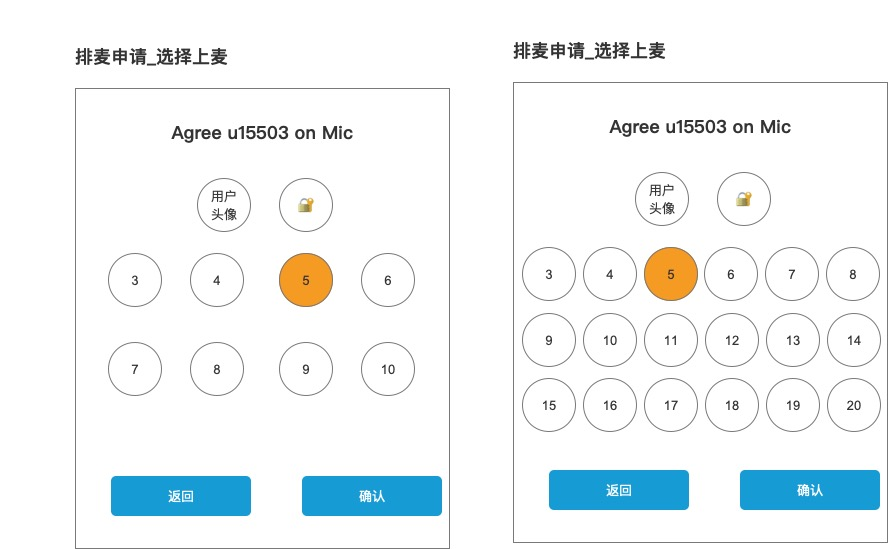
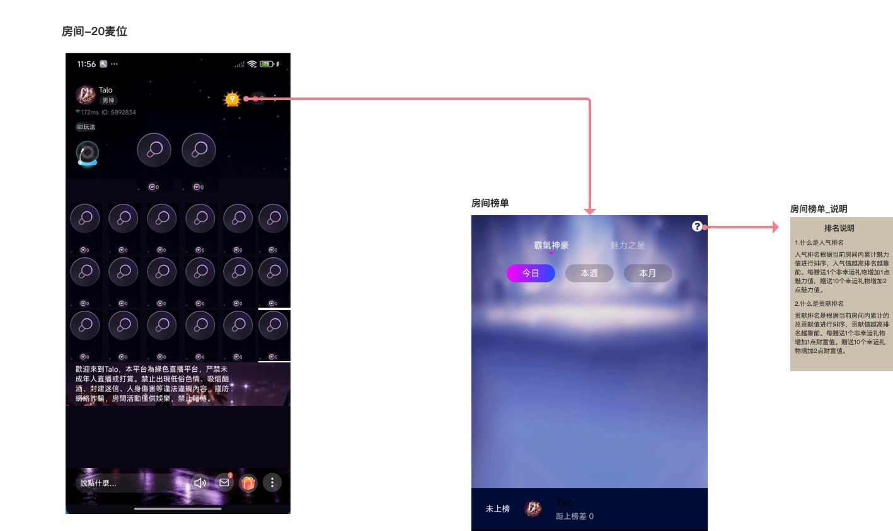
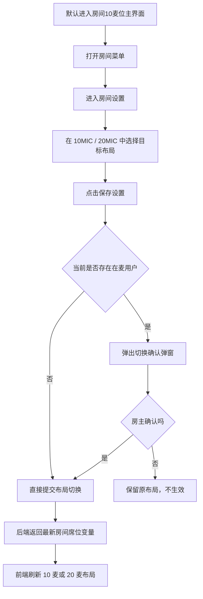
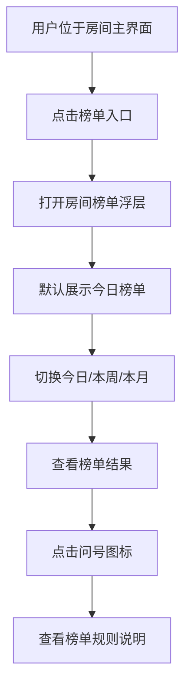

# 房间多麦位与房间榜单需求文档（PRD）

> 文档版本：V1.0  
> 产出时间：2026-06-06  
> 文档类型：产品需求文档  
> 适用范围：房间多麦位、房间设置中的麦位数量切换、房间菜单、房间榜单、排麦模式、放映厅逻辑  
> 原型来源：`/Users/mac/心音跳动/TOPKHLIJ/1.0版本/房间模块/TOP_khalij房间1.0原型图`  
> 说明：本文档合并房间多麦位、房间榜单、排麦模式与放映厅逻辑，作为 TOPKHLIJ 房间模块主 PRD 使用。

---

## 一、产品目标

本需求文档只保留四类核心能力：

1. **多麦位能力**：围绕房间内麦位展示、麦位数量切换、席位状态与主界面布局变化。
2. **房间榜单能力**：围绕房间榜单入口、榜单展示、榜单规则说明、榜单排序规则和异常边界。
3. **排麦模式能力**：围绕排麦入口、普通用户申请链路、房主/管理员审批链路、排序规则与管理员权限。
4. **放映厅逻辑**：作为独立房型逻辑保留在本文档末尾，避免与普通多麦位主链路混淆。

---

## 二、文档范围

### 2.1 本文档保留内容

1. 房间主界面（10麦 / 20麦）展示规则。
2. 房间菜单入口与房间管理入口。
3. 房间设置页中的麦位数量切换。
4. 切换麦位后的保存确认提示。
5. 布局切换对前台主界面与在麦用户的影响。
6. 房间榜单页面与榜单说明入口。
7. 房间榜单的排序、时间维度与边界规则。
8. 排麦模式入口、申请、审批、排序与权限规则。
9. 放映厅房型逻辑。

### 2.2 本文档剥离内容

无。本文档已合并主 PRD 与补充文档中的核心逻辑。

---

## 三、核心页面结构

### 3.1 房间主界面（默认 10 麦）

#### 对应原型

#### 功能描述

房间主界面是多麦位系统的主要承载页面。

结合当前原型，用户默认进入的是 **10 麦位主界面**。

页面主要包括：
- 房主信息区
- 麦位展示区
- 房间公告/欢迎语
- 底部输入区
- 礼物、消息、菜单等快捷入口

#### 交互逻辑

1. 用户进入房间后，系统先按当前已生效布局渲染主界面。
2. 在默认状态下，房间展示为 10 麦位页面。
3. 用户可在主界面点击菜单入口，进入房间菜单。
4. 用户可在主界面点击榜单入口，进入房间榜单。

#### 状态设计

| 页面状态 | 说明 |
|---|---|
| 房间_10麦位 | 默认主界面，展示 10 个麦位位置 |

---

### 3.2 房间主界面（切换后 20 麦）

#### 对应原型

#### 功能描述

当房主在房间设置中把麦位数量从 10MIC 切换到 20MIC 并保存生效后，房间主界面切换为 20 麦位展示方案。

#### 交互逻辑

1. 房间布局切换成功后，前台房间页更新为 20 麦位布局。
2. 用户会看到更高密度的麦位排列。
3. 房间内的榜单入口和主界面其他基础能力保持不变。

#### 状态设计

| 页面状态 | 说明 |
|---|---|
| 房间_20麦位 | 切换保存后的扩展主界面，展示 20 个麦位位置 |

---

### 3.3 房间菜单

#### 对应原型

#### 功能描述

房间菜单是房间主界面上的底部功能面板，用于承接房间级能力入口。

原型中可见入口包括：
- 房间管理
- 房间魅力值
- 关闭公屏
- 排麦模式
- 关闭音乐
- 辅助功能
- 关闭特效
- 举报

#### 交互逻辑

1. 用户在房间主界面打开菜单。
2. 系统自底部弹出菜单面板。
3. 用户点击“房间管理”后进入房间设置页。
4. 其他入口按对应能力进入后续流程。

#### 业务规则

1. 房间菜单属于浮层能力，不改变主界面主体结构。
2. 本文档中的房间菜单保留与多麦位、房间设置、房间榜单、排麦模式直接相关的描述。

---

## 四、房间设置与麦位数量切换

### 4.1 房间设置页

#### 对应原型

#### 功能描述

房主可以通过房间设置页，对房间进行基础管理。

当前原型可见配置项包括：
- 房间封面
- 房间名称
- 房间玩法
- 房间背景
- 是否在房间列表上展示
- 进房密码
- 麦位数量
- 管理员编辑
- 禁言列表
- 麦位流水
- 访客记录

#### 麦位数量规则

1. 当前原型仅提供两档麦位布局：
   - 10MIC
   - 20MIC
2. 默认选中 **10MIC**。
3. 点击卡片后，仅更新当前设置页的选中态，不会立即改变房间主界面。
4. 必须点击“保存设置”后才真正生效。

#### 字段与数据来源

| 字段 | 说明 | 数据来源 |
|---|---|---|
| 当前麦位数量 | 当前房间已生效的布局数量 | 房间配置 |
| 目标麦位数量 | 房主当前在设置页中选择的布局数量 | 用户选择动作 |
| 当前是否已有在麦用户 | 用于判断保存时是否需要二次确认 | 房间席位状态 |

---

### 4.2 麦位数量切换确认逻辑

#### 对应原型

#### 功能说明

房主在房间设置页中修改麦位数量后，不会立即生效，必须通过保存动作提交。

若当前房间已有用户在麦，则系统弹出二次确认提示，再决定是否真正执行布局切换。

#### 前置条件

1. 当前用户为房主，或具备房间设置修改能力。
2. 当前用户已进入房间设置页。
3. 当前设置页中已经选中了新的麦位数量方案（10MIC 或 20MIC）。
4. 当前房间配置允许提交房间设置变更。

#### 字段与数据来源

| 字段 | 说明 | 数据来源 |
|---|---|---|
| 当前生效麦位数量 | 当前房间主界面实际生效的麦位数量 | 房间配置 |
| 目标麦位数量 | 用户在设置页中选择的目标麦位数量 | 设置页操作状态 |
| 是否存在在麦用户 | 判断是否需要弹出二次确认的依据 | 房间席位状态 |
| 麦位锁定状态集合 | 当前各席位是否处于被锁定状态 | 房间席位状态 |
| 麦位静音状态集合 | 当前各席位是否处于被静音状态 | 房间席位状态 |
| 保存结果 | 房间设置提交是否成功 | 系统返回结果 |

#### 交互逻辑

1. 房主在“麦位数量”区域切换 10MIC / 20MIC 卡片。
2. 页面只更新卡片选中态，不立即改变房间主界面。
3. 房主点击“保存设置”后，系统开始提交房间设置。
4. 若当前没有用户在麦，则系统直接执行布局切换。
5. 若当前存在在麦用户，则系统弹出确认弹窗，提示切换影响。
6. 房主点击确认后，系统真正执行房间麦位重置与布局切换。
7. 切换成功后，房间主界面刷新为新的麦位数量展示方案。

#### 关键提示文案

原型明确体现：
- 房间设置保存后才可生效。
- 从 10 麦位切换到 20 麦位时，已在麦用户无需下麦。
- 从 20 麦位切换到 10 麦位时，11-20 麦位用户自动下麦，1-10 麦位用户不下麦。

#### 系统后台核心逻辑

1. 麦位数量切换属于房间级布局调整动作。
2. 切换提交成功后，系统按新的麦位数量布局重建当前房间麦位状态。
3. 麦位数量切换时的用户下麦规则：
   - 从 10 麦位切换到 20 麦位：已在麦用户无需下麦，直接保留原麦位状态。
   - 从 20 麦位切换到 10 麦位：11-20 麦位用户自动下麦，1-10 麦位用户不下麦。
4. 麦位锁定状态与静音状态在切换后保持原状态，不自动恢复。
5. 切换完成后，前端按新的房间变量重新解析麦位、刷新页面并重算用户是否仍在麦上。
6. 前端当前不会主动迁移旧麦位上的用户，只会按后端回推结果刷新最终状态。

#### 边界情况

| 场景 | 处理规则 |
|---|---|
| 仅选择新麦位数量但未点击保存 | 不生效 |
| 当前有在麦用户 | 弹出二次确认 |
| 从 10 麦位切换到 20 麦位 | 已在麦用户无需下麦，直接保留原麦位状态 |
| 从 20 麦位切换到 10 麦位 | 11-20 麦位用户自动下麦，1-10 麦位用户不下麦 |
| 原本被锁定的麦位 | 保持原锁定状态，不自动恢复 |
| 原本被静音的麦位 | 保持原静音状态，不自动恢复 |
| 布局切换后当前用户不在任何席位上 | 前端改为未上麦状态并停止推流 |

#### 业务流程图

---

## 五、排麦模式逻辑

### 5.1 排麦模式定位

#### 功能说明

排麦模式是房间内的受控上麦机制，与自由上麦模式互斥。

在该模式下：
- 普通用户不能直接占用空麦位；
- 用户需要先进入排队列表，再由房主或管理员审批；
- 审批通过后，系统再为用户分配具体麦位；
- 房主仍可直接上任意空麦位，管理员是否可自由上下麦，取决于房主授权。

#### 前置条件

1. 当前房间为普通派对房或支持排麦模式的房型。
2. 当前用户为房主，具备切换房间模式权限。
3. 当前房间不存在阻断模式切换的活动或玩法状态。

#### 字段与数据来源

| 字段 | 说明 | 数据来源 |
|---|---|---|
| 房间模式 | 当前房间处于排麦模式或自由上麦模式 | 房间配置 |
| 在麦用户列表 | 当前已在麦位上的用户列表 | 房间席位状态 |
| 房主权限 | 房主是否具备切换模式权限 | 用户权限配置 |
| 管理员自由上下麦权限 | 管理员是否具备自由上下麦能力 | 管理员权限配置 |
| VIP权益状态 | 排麦模式下部分 VIP 权益是否生效 | 房间模式规则 |

#### 业务规则

1. 仅房主可切换排麦模式，管理员无此权限。
2. 房主可通过房间功能菜单进入排麦模式配置入口。
3. 排麦模式开启后，普通用户进入“申请上麦 / 排队列表”链路。
4. 房主与被授权管理员进入“审批 / 分配麦位”链路。
5. 当房主切换房间模式为排麦模式时，所有当前在麦上的用户自动下麦。
6. 排麦模式下，用户可自行下麦，但无法踢他人下麦，VIP 踢人权益不适用。
7. 排麦模式下，房主或被授权管理员仍然可以锁麦。

#### 系统后台核心逻辑

1. 房主切换排麦模式时，系统需先检查当前是否有在麦用户。
2. 若有在麦用户，系统自动执行下麦操作，并同步通知相关用户。
3. 模式切换成功后，系统更新房间状态变量，并同步给所有在线用户。
4. 排麦模式生效期间，系统阻断普通用户的直接上麦路径。

#### 边界情况

| 场景 | 处理规则 |
|---|---|
| 房主切换排麦模式时已有用户在麦 | 所有在麦用户自动下麦 |
| 管理员尝试切换排麦模式 | 无权限，入口不展示或置灰 |
| 房间内存在阻断模式切换的活动 | 提示无法切换，需先结束相关状态 |
| VIP 用户尝试踢他人下麦 | toast：排麦模式下该权益不适用 |

---

### 5.2 排麦模式入口与普通用户视角

#### 对应原型

**功能描述：** 房主通过房间菜单中的排麦模式开关进入排麦模式配置。  
**关键交互：** 点击排麦模式开关后，房间进入排麦模式，所有用户视角房间页面底部出现排麦悬浮窗。

**功能描述：** 普通用户视角出现排麦悬浮窗，用于进入申请上麦与排队列表。  
**关键交互：** 用户点击排麦悬浮窗后，进入申请上麦弹窗。

**功能描述：** 普通用户申请上麦页面展示当前排队列表、申请上麦按钮和取消排队状态。  
**关键交互：** 弹窗默认展示排队列表（空则展示缺省图标）与“申请上麦”按钮；用户申请成功后，按钮切换为“取消排队”。

**功能描述：** 抱麦页面是排麦模式下的独立用户操作页面，用于承接用户进入抱麦链路后的状态展示与操作反馈。该页面与“申请上麦列表”共同构成普通用户侧的上麦申请体验，但不等同于排队列表本身。  
**关键交互：** 用户进入抱麦页面后，可查看当前抱麦状态、候选操作入口及页面反馈；具体是否展示申请、取消、等待、已上麦等状态，以房间当前排麦状态与用户本人状态为准。

#### 功能说明

排麦模式生效后，所有用户视角房间页面底部出现排麦悬浮窗，阿语版位置在底部最右侧。

#### 前置条件

1. 当前房间处于排麦模式。
2. 当前用户不是房主，也未直接处于自由上下麦路径。
3. 当前点击的麦位未被锁定，或用户主动点击排麦悬浮窗。

#### 字段与数据来源

| 字段 | 说明 | 数据来源 |
|---|---|---|
| 排麦悬浮窗 | 普通用户进入申请上麦链路的入口 | 房间排麦状态 |
| 当前排队列表 | 当前已申请上麦的用户列表 | 排麦队列 |
| 申请按钮状态 | 申请上麦 / 取消排队 | 当前用户排队状态 |
| 当前用户队列状态 | 是否已申请 | 排麦队列状态 |
| 缺省图标状态 | 排队列表是否为空 | 排麦队列 |
| 财富等级标签 | 用户财富等级展示值 | 用户资料 |
| VIP标签 | 用户 VIP 等级展示值 | 用户资料 |
| 国家标签 | 用户所在国家 | 用户资料 |
| 主播/公会长身份标签 | 用户身份类型标签 | 用户资料 |

#### 交互逻辑

1. 普通用户点击空麦位或排麦悬浮窗。
2. 系统打开申请上麦弹窗。
3. 弹窗默认展示当前排队列表；若当前列表为空，则展示缺省图标与“申请上麦”按钮。
4. 抱麦 / 在线用户列表中的用户信息展示顺序为：VIP（如有）→ 国家 → 财富等级 → 贡献值 → 身份标签（主播或公会长）。
5. 用户点击“申请上麦”后，系统按抱麦 / 在线用户列表排序规则刷新展示顺序，按钮切换为“取消排队”。
6. 抱麦 / 在线用户列表排序规则为：财富等级降序；同财富等级下，贡献值更高者靠前；同贡献值下，VIP等级更高者靠前；同VIP等级下，进房时间更早者靠前。
7. 用户点击“取消排队”后，toast 提示“已取消排队”，刷新排队列表数据，按钮恢复为“申请上麦”。
8. 房主/管理员视角审批弹窗同步清除该申请数据。
9. 用户在不同排麦状态下，可进入对应的普通用户操作页面；其中“抱麦”页面作为独立状态页，用于承接申请后的补充展示与反馈。

#### 用户标签展示规则

1. 用户标签展示顺序固定为：VIP（如有）→ 国家 → 财富等级 → 身份标签。
2. 若用户仅是主播，则展示主播标签。
3. 若用户是公会长，则仅展示公会长标签，不展示主播标签。
4. 若用户没有主播或公会长身份，则不展示身份标签。

#### 系统后台核心逻辑

1. 申请上麦成功后，应把当前用户写入排麦队列，并同步给房主/管理员审批视图。
2. 抱麦 / 在线用户列表的排序规则为：财富等级降序；同财富等级下，贡献值更高者靠前；同贡献值下，VIP等级更高者靠前；同VIP等级下，进房时间更早者靠前。
3. 排麦列表的排序规则为：财富等级降序；同财富等级下，VIP等级更高者靠前；同VIP等级下，申请时间更早者靠前。
4. 用户退出房间时，排队数据取消；用户最小化房间时，排队数据仍保留。
5. 弹窗需即时刷新，任意用户的队列更新，都应同步到其他打开中的排麦弹窗。

#### 边界情况

| 场景 | 处理规则 |
|---|---|
| 用户已在排队中再次点击申请 | 按取消排队逻辑处理 |
| 用户点击取消排队 | toast：已取消排队，刷新列表 |
| 用户最小化房间 | 队列中仍保留该用户 |
| 用户退出房间 | 自动取消排队 |
| 当前用户已被同意上麦 | 申请按钮不再可用，用户进入已上麦状态，可点击空麦位切换 |
| 已上麦用户点击上锁麦位 | toast：该麦位已锁定，无法切换 |
| 排队列表为空 | 展示缺省图标 |

---

### 5.3 房主/管理员审批链路

#### 对应原型

**功能描述：** 房主与被授权管理员通过审批视图统一处理排麦申请，包括红点提醒、申请列表、同意/拒绝/清空与搜索。  
**关键交互：** 当有新的上麦申请时，审批入口出现红点；进入审批视图后可对用户进行同意、拒绝、清空、搜索等操作。

**功能描述：** 麦位选择弹窗用于在审批同意后，为目标用户分配具体可上麦位。  
**关键交互：** 房主或管理员点击同意后跳转到该弹窗，弹窗展示当前麦位数量布局与已在麦用户头像；选中空麦位后确认按钮高亮，点击确认则目标用户立即上指定麦位。

#### 功能说明

结合新版原型，房主与被授权管理员都可以进入排麦审批视图。若房主授权管理员排麦管理权限，则管理员视角与房主在排麦审批上保持一致；若不授权，则仅房主可操作。

#### 前置条件

1. 当前房间已切换为排麦模式。
2. 当前用户为房主，或被授予排麦管理权限的管理员。
3. 当前队列中存在待审批申请。

#### 字段与数据来源

| 字段 | 说明 | 数据来源 |
|---|---|---|
| 红点状态 | 是否存在新的上麦申请 | 排麦状态 |
| 审批列表用户 | 当前待审批用户列表 | 排麦队列 |
| 用户标签信息 | VIP、国家、财富等级、主播/公会长身份标签 | 用户资料 |
| 目标麦位 | 同意后分配的具体麦位 | 麦位选择动作 |
| 当前麦位布局 | 当前房间的麦位数量与布局 | 房间配置 |
| 已上麦用户头像 | 当前已在麦上的用户头像列表 | 房间席位状态 |
| 确认按钮状态 | 是否高亮可点击 | 麦位选择状态 |
| 搜索框关键词 | 用户ID / 靓号搜索值 | 搜索输入状态 |

#### 用户标签展示规则

1. 用户列表中，标签展示顺序为：VIP（如有）→ 国家 → 财富等级 → 身份标签（主播或公会长）。
2. 若用户仅是主播，则展示主播标签。
3. 若用户是公会长，则仅展示公会长标签，不展示主播标签。
4. 审批列表与普通用户列表展示的用户标签字段必须保持统一。

#### 交互逻辑

1. 当有新的上麦申请时，房主（以及已授权管理员）视角的排麦悬浮窗出现红点。
2. 房主/管理员点击悬浮窗，打开上麦审批弹窗。
3. 房主/管理员打开审批弹窗后，该用户视角红点消失；其他房主/管理员视角红点仍显示。
4. 当审批列表为空时，所有房主/管理员视角的红点均消失。
5. 审批弹窗展示待审批用户列表，每个用户展示：VIP、国家、财富等级、身份标签。
6. 审批列表排序规则与排麦列表保持一致：财富等级降序；同财富等级下，VIP等级更高者靠前；同VIP等级下，申请时间更早者靠前。
7. 点击“同意”后，跳转到选择具体麦位弹窗。
8. 选中空麦位后，确认按钮高亮；点击确认，被审批用户立即上指定麦位，并返回审批弹窗刷新列表。
9. 点击“返回”仅回到前一审批弹窗。
10. 点击“拒绝”后，该申请立即从列表移除。
11. 被拒绝用户收到 toast：“上麦申请被拒绝”，且 5 分钟内不可再次申请。
12. 点击“清空所有”后，弹出确认框，确认后清空全部申请，取消则关闭确认框。
13. 审批列表支持通过用户ID、靓号搜索目标用户。
14. 若搜索无结果，则 toast：“用户不存在，请重新输入”。
15. 若搜索命中，则只展示对应用户信息。

#### 系统后台核心逻辑

1. 若房主与管理员同时同意同一用户上麦，先成功的一次生效；后生效者提示“该成员已在麦上”。
2. 若被审批用户在审批前已取消排队，则同意或确认时失败，并提示“用户已取消排队”，随后自动回到审批弹窗并刷新列表。
3. 被拒绝的用户不在列表中继续展示。
4. 被拒绝用户需要等待 5 分钟后才能重新申请上麦。
5. 冷却期间再次申请时，toast：“上麦被拒绝，需等待5分钟后重新申请”。
6. 当审批列表为空时，所有房主/管理员视角的红点均消失。
7. 麦位选择确认前，必须再次校验目标麦位是否仍为空闲且未锁定。
8. 当房主选择房主和管理员均有踢人权限时，管理员踢掉的人，系统需向房主发送系统消息提醒。

#### 管理员踢人系统消息规则

当管理员执行踢人操作时，房主收到系统消息：

1. 下麦：管理员 xxx 于 x日x时x分 将用户 xxx 踢下麦。
2. 踢出房间：管理员 xxx 于 x日x时x分 将用户 xxx 踢出房间。

#### 边界情况

| 场景 | 处理规则 |
|---|---|
| 用户已取消排队 | toast：用户已取消排队，自动回到审批弹窗并刷新 |
| 同时多管理员同意同一用户 | 后生效者 toast：该成员已在麦上 |
| 搜索用户不存在 | toast：用户不存在，请重新输入 |
| 用户被拒绝后立即再次申请 | toast：上麦被拒绝，需等待5分钟后重新申请 |
| 审批时麦位已被占用 | 当前确认失败，需重新选择麦位或返回审批列表 |
| 审批列表为空 | 所有红点消失，审批入口恢复无提醒状态 |
| 房主/管理员打开审批弹窗后 | 当前用户红点消失，其他红点仍显示 |

---

### 5.4 排麦排序与展示规则

#### 功能说明

排麦模式下，抱麦 / 在线用户列表与排麦列表的展示字段不同，因此两者排序口径不同，但都不是随机展示。

#### 字段与数据来源

| 字段 | 说明 | 数据来源 |
|---|---|---|
| 用户财富等级 | 抱麦 / 在线用户列表与排麦列表的共同主排序字段 | 用户资料 |
| 贡献值 | 抱麦 / 在线用户列表的次排序字段 | 房间内用户贡献统计 |
| VIP等级 | 抱麦 / 在线用户列表与排麦列表的排序字段之一 | 用户资料 |
| 进房时间 | 抱麦 / 在线用户列表的最终兜底排序字段 | 房间在线用户数据 |
| 申请时间 | 排麦列表的最终兜底排序字段 | 排麦队列 |
| 用户国家 | 用户所在国家（用于标签展示） | 用户资料 |
| 用户身份标签 | 主播 / 公会长标签（用于标签展示） | 用户资料 |
| 搜索关键词 | 用户ID / 靓号 | 搜索输入状态 |

#### 业务规则

1. 抱麦 / 在线用户列表排序规则：财富等级降序排序；同财富等级下，贡献值更高者靠前；同贡献值下，VIP等级更高者靠前；同VIP等级下，进房时间更早者靠前。
2. 排麦列表排序规则：财富等级降序排序；同财富等级下，VIP等级更高者靠前；同VIP等级下，申请时间更早者靠前。
3. 抱麦 / 在线用户列表与排麦列表展示字段不同，因此两者排序口径不同；排序字段应与当前列表可见字段保持一致。
4. 不展示用户队列名次，仅展示排序后的用户列表。
5. 审批列表侧的用户展示顺序应与排麦列表保持同一排序口径，避免不同身份看到不同顺序。

#### 边界情况

| 场景 | 处理规则 |
|---|---|
| 抱麦 / 在线用户列表中用户财富等级相同 | 按贡献值降序继续排序；同贡献值再按VIP等级降序；同VIP等级再按进房时间升序 |
| 排麦列表中用户财富等级相同 | 按VIP等级降序继续排序；同VIP等级再按申请时间升序 |
| 搜索无结果 | toast：用户不存在或当前列表为空 |
| 用户没有主播/公会长身份 | 不展示身份标签 |

---

### 5.5 管理员权限管理（排麦模式相关）

#### 对应原型

**功能描述：** 排麦模式下，管理员权限由房主统一配置，位置在房间-功能-管理员。  
**关键交互：** 房主可在管理员编辑页勾选或取消管理员各项权益；闲聊模式展示 4 个权益项，排麦模式下展示 6 个权益项。

#### 功能说明

排麦模式下，管理员能力由房主配置。若房主给管理员授权，则管理员可按权限操作用户上下麦；若不授权，则仅房主可操作。

#### 前置条件

1. 当前用户为房主。
2. 房主已进入房间设置页的管理员编辑入口。
3. 当前房间已切换为排麦模式。

#### 字段与数据来源

| 字段 | 说明 | 数据来源 |
|---|---|---|
| 管理员列表 | 当前房间的管理员名单 | 房间配置 |
| 权益勾选状态 | 各项权益是否勾选授权 | 管理员权限配置 |
| 房间模式 | 当前房间处于排麦模式或闲聊模式 | 房间配置 |
| 权益项数量 | 闲聊模式与排麦模式下展示的权益数量 | 房间模式规则 |

#### 业务规则

排麦模式下管理员可被配置的权益包括：

1. **踢人下麦**：管理员可将其他用户踢下麦位。
2. **踢人出房间**：管理员可将其他用户踢出房间。
3. **邀请用户上麦**：管理员可邀请指定用户上麦。
4. **锁麦权益**（默认开启）：管理员可锁定或解锁麦位。
5. **自由上下麦**（排麦模式下展示，默认开启）：管理员可自由上麦或下麦，不受排麦审批限制。
6. **操作排麦用户列表**（排麦模式下展示）：管理员可审批排麦申请，同意、拒绝、清空排麦列表。

闲聊模式下展示前 4 项权益；排麦模式下额外展示第 5、6 项权益。

#### 系统后台核心逻辑

1. 是否展示管理员审批能力，取决于房主是否授予管理员“操作排麦用户列表”权限。
2. 若房主授权，则管理员视角与房主在排麦审批上保持一致；若不授权，则仅房主可操作。
3. 管理员权限配置与实际前台能力必须一一对应，避免“已勾选权限但前台不可操作”或“未勾选但前台可操作”的错配。
4. 当房主选择房主和管理员均有踢人权限时，管理员踢人操作需向房主发送系统消息提醒。

#### 边界情况

| 场景 | 处理规则 |
|---|---|
| 房主取消管理员踢人权限 | 管理员无法踢人，入口不展示或置灰 |
| 房主取消管理员排麦审批权限 | 管理员审批入口不展示，仅房主可审批 |
| 管理员尝试操作未授权权益 | toast：无权限，请联系房主授权 |
| 排麦模式下管理员尝试自由上麦 | 若已授权则可上，未授权则需走审批链路 |

---

## 六、房间榜单功能

### 6.1 房间榜单入口与浮层

#### 对应原型

#### 功能描述

房间榜单以房间内浮层形式展示，当前原型包含：
- 榜单分类切换
- 时间维度切换
- 榜单说明入口
- 当前用户状态栏

#### 交互逻辑

1. 用户在房间主界面点击榜单入口。
2. 系统打开房间榜单浮层。
3. 榜单默认展示一个时间维度，结合原型默认为“今日”选中态。
4. 用户可切换“今日 / 本周 / 本月”。
5. 用户点击右上角问号图标后，打开榜单说明面板。

---

### 6.2 榜单类型定义

#### 功能说明

当前原型中，房间榜单至少包含两类维度：
- **人气榜**（魅力之星）
- **贡献榜**（霸气神豪）

#### 前置条件

1. 用户已进入房间榜单浮层。
2. 房间榜单具备可展示数据或空状态展示能力。

#### 字段与数据来源

| 字段 | 说明 | 数据来源 |
|---|---|---|
| 榜单类型 | 当前展示的是人气榜还是贡献榜 | 榜单切换状态 |
| 时间维度 | 今日 / 本周 / 本月 | 榜单筛选状态 |
| 用户积分值 | 当前用户在房间榜单中的累计积分值 | 榜单统计结果 |
| 达成时间 | 用户达到当前积分值的时间点 | 榜单排序辅助数据 |
| 用户账号状态 | 用户是否正常、已注销、已封号 | 用户状态 |

#### 业务规则

| 榜单类型 | 统计口径 |
|---|---|
| 人气榜 | 按当前房间内累计魅力值进行排序 |
| 贡献榜 | 按当前房间内累计财富值（贡献值）进行排序 |

---

### 6.3 榜单积分逻辑与统计口径

#### 功能说明

根据原型右侧“排名说明”中的规则说明，房间榜单不是抽象的热度榜，而是基于明确积分口径进行计算。

#### 原型规则说明还原

1. **人气榜（魅力之星）**
   - 统计对象：当前房间内累计魅力值。
   - 排序规则：魅力值越高，排名越靠前。
     - 每赠送 **1 个非幸运礼物**，增加 **1 点魅力值**；
     - 每赠送 **10 个幸运礼物**，增加 **2 点魅力值**。
   
2. **贡献榜（霸气神豪）**
   - 统计对象：当前房间内累计财富值（贡献值）。
   - 排序规则：财富值越高，排名越靠前。
   - 调整后的积分口径：
     - 每赠送 **1 个非幸运礼物**，增加 **1 点财富值**；
     - 每赠送 **10 个幸运礼物**，增加 **2 点财富值**。

> 说明：贡献榜积分口径已按最新产品确认规则调整；若礼物体系后续继续细化幸运礼物与非幸运礼物分类，以礼物规则最终口径为准。

#### 字段与数据来源

| 字段 | 说明 | 统计方式 | 数据来源 |
|---|---|---|---|
| 魅力值 | 人气榜使用的积分字段 | 当前房间内累计魅力值 | 房间榜单统计结果 |
| 财富值 | 贡献榜使用的积分字段 | 当前房间内累计财富值 | 房间榜单统计结果 |
| 非幸运礼物贡献值 | 贡献榜普通礼物积分来源 | 每赠送1个非幸运礼物增加1点财富值/1点魅力值 | 礼物行为统计结果 |
| 幸运礼物贡献值 | 贡献榜特殊礼物积分来源 | 每赠送10个幸运礼物增加2点财富值/2点魅力值 | 礼物行为统计结果 |
| 今日榜积分 | 当日维度榜单积分 | 当日累计结果 | 榜单统计结果 |
| 本周榜积分 | 本周维度榜单积分 | 本周累计结果 | 榜单统计结果 |
| 本月榜积分 | 本月维度榜单积分 | 本月累计结果 | 榜单统计结果 |
| 达成时间 | 用户达到当前积分值的时间点 | 用于同积分排序 | 榜单排序辅助数据 |

#### 系统后台核心逻辑

1. 榜单积分统计必须限定在**当前房间内**，不能跨房间累计。
2. 榜单类型切换时，人气榜与贡献榜分别读取各自积分字段。
3. 贡献榜积分统计时，需要区分非幸运礼物与幸运礼物两类口径：非幸运礼物按单件累计，幸运礼物按“每10个增加2点财富值”口径累计。
4. 时间维度切换时，系统分别按“今日 / 本周 / 本月”读取对应周期累计值。
5. 同积分排序必须保留“先到达该积分的时间”作为次排序依据，保证榜单排序稳定。

---

### 6.4 榜单时间维度与排序规则

#### 功能说明

当前原型中，榜单支持以下时间维度：
- 今日
- 本周
- 本月

#### 业务规则

1. 默认进入榜单时，展示“今日”榜单。
2. 用户可以切换到“本周”与“本月”。
3. 榜单主排序按积分值降序。
4. 当积分相同时，**积分先到达者靠前排名**。

#### 排序规则定义

| 排序层级 | 规则 |
|---|---|
| 第一排序键 | 积分值高者靠前 |
| 第二排序键 | 同积分时，先达到该积分者靠前 |

---

### 6.5 榜单边界情况与异常规则

#### 功能说明

房间榜单不仅要定义正常展示逻辑，还要处理异常用户状态和排序边界。

#### 边界情况

| 场景 | 处理规则 |
|---|---|
| 已注销用户 | 不在榜单展示 |
| 已封号用户 | 不在榜单展示 |
| 同积分用户 | 积分先到达者排名靠前 |
| 当前用户未上榜 | 底部展示“未上榜”与距上榜差值 |

#### 系统后台核心逻辑

1. 榜单可见名单应先过滤已注销与已封号用户，再做展示。
2. 过滤异常用户后，榜单名次应顺位递补。
3. 当前用户若未进入榜单展示范围，前端仍需在底部显示自身未上榜状态。

---

### 6.6 榜单说明入口

#### 功能说明

用户可通过榜单页右上角问号图标进入榜单规则说明。

#### 交互逻辑

1. 用户在房间榜单页点击问号图标。
2. 系统打开榜单说明面板。
3. 面板中展示人气榜与贡献榜的统计口径说明。

---

## 七、保留的多麦位业务流程图

### 7.1 麦位数量切换流程

### 7.2 房间榜单访问流程

## 
